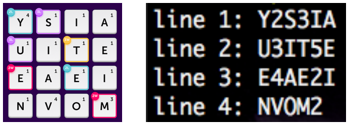

# Word Blitz

#### Code to play the Word Blitz game or variants thereof

### Usage:
1. Run `python gen.py (dimension)`. Eg: `python gen.py 3` or `python gen.py`  
    _**Note: Dimension is an optional argument with default value 4**_
2. Input the data line by line (case-insensitive)  
    _For bonuses trail the letters with the bonus code. [2L = 2, 3L = 3, 2W = 4, 3W = 5]_
3. The words are available in `cheat.txt` sorted by score. Scores used are from Scrabble.

Example Input:  

  
### If you want to use your own word list for the dictionary:

#### Run `python intake.py /path/to/your/word/list`
**Note: Your file should basically be a newline separated word list with no special characters**

The word list used by our code is provided as origins.txt

### Up next:
- [x] Sorting words by score.  
- [x] Adding support for score multipliers.  
- [ ] Subsorting words by edit distance so closer words appear together.  